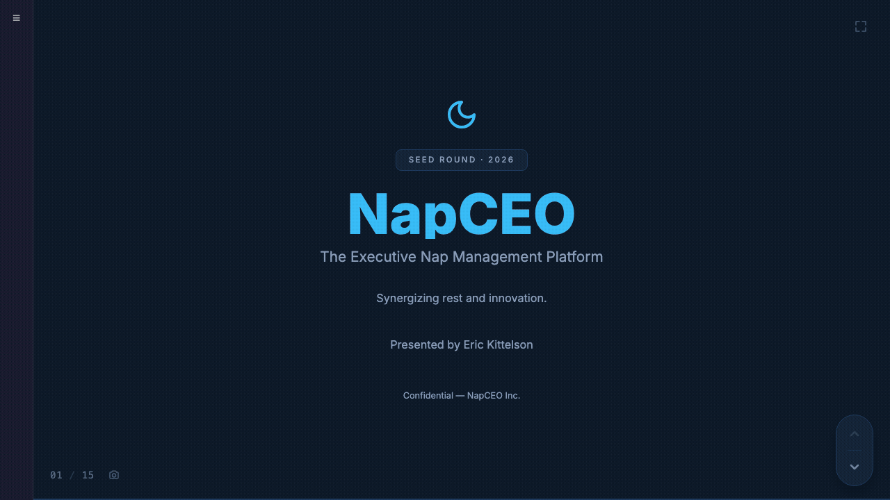

<div align="center">

# Slidemason

**Turn your documents into polished presentations in minutes — using the AI coding tools you already have.**

No API keys. No environment variables. No accounts to create. No data uploaded anywhere.<br>
Just clone, run, and tell your AI agent to build the deck.

[](LICENSE)
[](https://www.typescriptlang.org/)
[](https://react.dev/)
[](https://vite.dev/)
[](https://pnpm.io/)



</div>

---

## What makes this different

**You don't need to sign up for anything.** Most AI presentation tools (Gamma, Beautiful.ai, Tome) require accounts, monthly subscriptions, and your data on their servers. Slidemason is different:

- **Zero configuration** — No API keys, no `.env` files, no secrets, no tokens. Clone the repo and run it.
- **Uses tools you already have** — If you use Cursor, Windsurf, GitHub Copilot, Claude Code, or any AI coding agent, you already have everything you need. Slidemason is just a project you open in your editor.
- **100% local** — Your documents, briefs, and generated presentations never leave your machine. Upload your board deck, financials, or internal strategy — none of it touches the internet.
- **Free and open source** — The only cost is whatever you already pay for your AI coding tool (and most have free tiers).

> **Think of it this way:** You know how your AI coding agent can build websites, fix bugs, and write code? Slidemason gives it a presentation builder to work with. Same agent, same workflow, new superpower.

---

## New to AI coding tools? Start here

Slidemason is actually a **great first project** if you've been curious about AI-assisted coding but haven't tried it yet. You don't need to know how to code — the AI does the work. You just describe what you want.

### Pick an AI coding tool

These are editors (or terminal tools) where an AI assistant helps you write code. You type instructions in plain English, and it writes the code for you.

| Tool | Free tier? | Best for | Get it |
|---|---|---|---|
| **Cursor** | Yes (limited) | Visual editor, feels like VS Code | [cursor.com](https://www.cursor.com/) |
| **Windsurf** | Yes (generous) | Beginner-friendly, unlimited completions | [windsurf.com](https://windsurf.com/) |
| **GitHub Copilot** | Yes (limited) | Already use VS Code or GitHub? Start here | [github.com/copilot](https://github.com/features/copilot) |
| **Claude Code** | Free with API key | Terminal power users, best reasoning | [claude.ai/claude-code](https://docs.anthropic.com/en/docs/claude-code) |

> **Our recommendation:** If you've never used any of these, download **Cursor** or **Windsurf**. They're standalone apps — install, open, and you're ready. Both have free tiers that are more than enough to build presentations.

### Install the prerequisites

You need two things installed on your computer:

**Node.js** (the runtime that runs Slidemason):
- **Mac:** Open Terminal and run `brew install node` (if you have Homebrew) or download from [nodejs.org](https://nodejs.org/)
- **Windows:** Download the LTS installer from [nodejs.org](https://nodejs.org/) and run it

**pnpm** (the package manager):
```bash
npm install -g pnpm
```

**Git** (to clone the repo):
- **Mac:** Run `xcode-select --install` in Terminal (installs Git automatically)
- **Windows:** Download from [git-scm.com](https://git-scm.com/downloads)

That's it. Three tools, all free, all one-time installs.

### What else can you do with these tools?

Once you have an AI coding tool set up, Slidemason is just the beginning. The same setup lets you:

- **Build websites** — "Create a personal portfolio site with my resume"
- **Automate tasks** — "Write a script that renames all my photos by date"
- **Analyze data** — "Read this CSV and make a chart of monthly sales"
- **Build apps** — "Make a todo app" or "Build a budget tracker"
- **Learn to code** — "Explain this code to me" or "Teach me how React works"

Slidemason is a great starter project because the feedback loop is instant — you see your slides update in real-time as the AI writes them.

---

## Quick Start

```bash
git clone https://github.com/erickittelson/slidemason.git
cd slidemason
pnpm install
pnpm dev        # Studio opens at http://localhost:4200
```

Open the studio in your browser, fill out a brief, then tell your AI agent:

> "Read the CLAUDE.md file, then read the brief and source files in decks/my-deck/, and generate the slides."

That's it. The agent reads the instructions and builds the deck. Slides hot-reload as it writes them.

---

## Why Slidemason?

| | Traditional tools | Slidemason |
|---|---|---|
| **Setup** | Create account, pick a plan, enter payment | `git clone` and `pnpm dev` — done |
| **Design** | Pick a template, fight with it | Every slide is bespoke — unique layout, typography, animations |
| **Data** | Copy-paste into chart wizards | Upload source docs, agent reads and structures everything |
| **Time** | 2-4 hours per deck | Under 5 minutes |
| **Cost** | $20-30/mo for Canva/Gamma/Beautiful.ai | Free and open source. Agent costs ~8-40 cents per deck |
| **Privacy** | Your data on their servers | 100% local. Nothing leaves your machine |
| **Lock-in** | Proprietary formats | Standard React, JSON, CSS. Readable and versionable |
| **Agent** | Locked to one AI | Works with Cursor, Windsurf, Copilot, Claude Code, or any agent |

---

## Features

- **Zero config, zero accounts** — No API keys, no environment variables, no `.env` file. Clone and run.
- **Any AI agent** — Works with Cursor, Windsurf, GitHub Copilot, Claude Code, or any coding agent. Instructions auto-load via `CLAUDE.md` (symlinked for all platforms).
- **7-step studio workflow** — Guided sidebar walks you through source files, brief, vision, theme, fonts, branding, and images. Everything saves to a JSON brief your agent reads.
- **36 slide primitives** — Layout (`Split`, `Grid`, `Stack`), visual (`Card`, `Badge`, `StatBox`, `IconCircle`), data (`Chart`, `DataTable`), animation (`Animate`, `CountUp`, `TypeWriter`, `Stagger`), and interactive (`Tabs`, `Accordion`, `ClickReveal`, `Flipcard`, `Sortable`).
- **12 beautiful themes** — Dark, light, colorful, corporate. Switch instantly.
- **Google Fonts** — Curated pairings or search the full library.
- **Branding** — Upload your logo (with placement control) and set footer text.
- **Live preview** — Slides hot-reload as the agent writes them.
- **Export to PDF** — One-click, high-DPI, pixel-perfect PDF. Looks almost identical to the screen.
- **Export to PPTX** — One-click PowerPoint export. Content lands structured — layout needs manual adjustment.
- **Crash-proof** — Invalid props fall back gracefully. AI agents can make mistakes without killing the deck.
- **Open and inspectable** — Briefs are JSON, slides are TSX, themes are CSS.

---

## Themes

12 themes, each with 31 CSS variables for complete visual control:

| Theme | Vibe | Background | Primary | Secondary |
|---|---|---|---|---|
| `midnight` | Deep space |  `#0f172a` |  Indigo |  Violet |
| `slate` | Modern dark |  `#1e1e2e` |  Purple |  Cyan |
| `noir` | Stark monochrome |  `#0a0a0a` |  White |  Gray |
| `signal` | Electric accent |  `#0c0a1d` |  Green |  Blue |
| `neon` | Cyberpunk glow |  `#0a0a1a` |  Magenta |  Cyan |
| `sunset` | Warm gradient |  `#1e1b4b` |  Orange |  Pink |
| `dawn` | Soft sunrise |  `#faf5ff` |  Violet |  Rose |
| `canvas` | Clean light |  `#fafaf9` |  Blue |  Violet |
| `paper` | Minimal print |  `#fffbeb` |  Amber |  Brown |
| `boardroom` | Corporate polish |  `#1a1a2e` |  Sky |  Emerald |
| `forest` | Natural earth |  `#052e16` |  Green |  Gold |
| `glacier` | Cool clarity |  `#0c1222` |  Sky |  Indigo |

Set the theme in the brief and it applies automatically to every slide.

---

## How It Works

The studio sidebar walks you through 7 steps to build a brief. Then your AI agent reads the brief and source files and generates the slides.

| Step | What you do | What happens |
|:---:|---|---|
| **1** | Upload source files | PDFs, markdown, text — drag and drop |
| **2** | Fill out the brief | Audience, goal, tone, slide count, data density, visual style |
| **3** | Add your vision | Free-text instructions: "make it feel urgent", "emphasize Q3 numbers" |
| **4** | Pick a theme | 12 themes, live preview as you browse |
| **5** | Choose fonts | Curated pairings or search Google Fonts |
| **6** | Upload branding | Logo (with placement control) + footer text |
| **7** | Add deck images | Screenshots, diagrams, photos — with descriptions for the agent |

Hit **Build Deck** and the studio saves everything to `brief.json`. Then ask your agent to generate the slides — it reads the brief, source files, and images, and writes `slides.tsx`. Slides hot-reload as the agent writes them.

Once the deck looks good, export it as **PDF** or **PPTX** — both are one-click buttons in the sidebar.

---

## Exporting — PDF & PowerPoint

### PDF Export

Click **Export PDF** in the sidebar. You'll get a high-DPI, pixel-perfect PDF that looks nearly identical to what you see on screen. Dark backgrounds, gradients, glass effects, animations frozen at their final state — it all comes through. This is the best way to share a finished deck.

> The PDF is generated by screenshotting each slide at 2x resolution (3840x2160) and embedding them at 192 DPI. The result is crisp on Retina screens and prints beautifully.

### PowerPoint Export

Click **Export PPTX** in the sidebar. Fair warning: the PowerPoint export gets the content there — all your text, stats, structure, and data — but the visual layout won't match what you see on screen. Elements will land jumbled, spacing will be off, and you'll probably spend time rearranging things. That's the nature of converting bespoke web layouts to PowerPoint's box model.

But here's the thing — **it still saves you hours.** The hardest part of building a deck is the thinking: the narrative arc, what data to highlight, how to structure the argument, what to say on each slide. Slidemason and your AI agent do all of that. The PPTX export hands you the raw material. If your company requires `.pptx` format, you're getting a massive head start.

### The better workflow

Before you reach for PowerPoint, consider this: **you probably don't need to.**

The point of a presentation is to visually tell a story. Not to produce a file that conforms to corporate templates and formatting standards. Slidemason's PDF export gives you a polished, presentation-ready document that looks better than anything you'd build manually in PowerPoint or Google Slides.

And if something needs to change? Don't open PowerPoint. **Talk to the agent:**

- *"Make slide 7 more visual — add icons and less text"*
- *"Split slide 4 into two slides, it's too dense"*
- *"Add a slide after the revenue section showing customer logos"*
- *"The tone is too formal — make it feel more conversational"*
- *"Move the ask to slide 12 and make the number bigger"*

You can type, use voice-to-text, paste in new data, or give it a screenshot of a slide you like. The agent modifies the deck in seconds and you see the result instantly. This is the new medium — **you telling a story, AI helping you tell it.** Not you dragging rectangles, aligning 18 squares vertically and horizontally, and changing Calibri to Arial because someone's brand guidelines say so.

Your company probably has an OKR around using AI to increase productivity. This is you doing it. Spend less time in slides and more time on the work that actually matters — customer interviews, strategy, closing deals, building product. Let the AI handle the visual storytelling. That's what it's good at.

> **Our take:** The future of presentations isn't PowerPoint or Google Slides. It's you describing what you want and an AI building it. Slidemason is pioneering in storytelling, not text and shapes and corporate requirements.

---

## How Slides Work

Every slide is bespoke JSX — not a template fill-in. The agent designs each slide's layout, typography, colors, and animations from scratch based on the content.

```tsx
import { Slide, Heading, GradientText, Badge, Text, Split, Card, Grid,
         Animate, CountUp, Stagger, StatBox, IconCircle } from '@slidemason/primitives';
import { Zap, Shield, Globe } from 'lucide-react';

const slides = [
  <Slide key="s1" layout="center" bg="mesh">
    <Badge>Series A · 2026</Badge>
    <GradientText size="hero">Product Name</GradientText>
    <Text muted>One line that captures the vision</Text>
  </Slide>,

  <Slide key="s2" layout="free">
    <Animate effect="fade-up">
      <Heading>Key Metric</Heading>
    </Animate>
    <CountUp to={2.3} prefix="$" suffix="M" decimals={1} />
  </Slide>,
];

export default slides;
```

All colors come from theme CSS variables (`var(--sm-primary)`, `var(--sm-surface)`, etc.) so slides look great in any theme without changing code.

---

## Responsive Design

Slides adapt to any screen — monitors, laptops, tablets, studio panels. No fixed aspect ratio, no scale-to-fit. Content reflows like a responsive web app.

| Technique | What it does |
|---|---|
| **CSS Container Queries (`cqi`/`cqb`)** | Sizing resolves against the slide container — not the browser window. Works correctly fullscreen or in a narrow panel. |
| **`cqb` vertical spacing** | Vertical gaps scale with container height. On tall screens, spacing stretches. On short screens, it compresses. |
| **Responsive-by-default layouts** | `Grid` auto-collapses columns. `Split` stacks on narrow screens. No opt-in needed. |
| **Flex-centered slides** | Content is vertically centered. No wasted space at the top. |

---

## Tech Stack

<table>
<tr>
<td align="center"><a href="https://react.dev/"><br><sub>React 19</sub></a></td>
<td align="center"><a href="https://vite.dev/"><br><sub>Vite 7</sub></a></td>
<td align="center"><a href="https://www.typescriptlang.org/"><br><sub>TypeScript 5.9</sub></a></td>
<td align="center"><a href="https://tailwindcss.com/"><br><sub>Tailwind v4</sub></a></td>
<td align="center"><a href="https://www.framer.com/motion/"><br><sub>Framer Motion</sub></a></td>
<td align="center"><a href="https://playwright.dev/"><br><sub>Playwright</sub></a></td>
</tr>
</table>

| Layer | Technology | Purpose |
|---|---|---|
| **Frontend** | React 19 + Vite 7 | Fast dev server with instant HMR |
| **Styling** | Tailwind CSS v4 | Utility-first styling with CSS variables |
| **Animation** | Framer Motion 12 | Slide transitions and element animations |
| **Icons** | Lucide React | 1,500+ icons for visual anchors |
| **Charts** | Recharts 3 | Bar, line, area, and pie charts |
| **Export** | Playwright + PptxGenJS | Headless browser for PPTX and PDF export |
| **Types** | TypeScript 5.9 | End-to-end type safety |
| **Monorepo** | pnpm workspaces | Package management across 5 packages |
| **Testing** | Vitest + Testing Library | Unit tests including crash-proof primitives |

---

## Project Structure

```
slidemason/
├── packages/
│   ├── primitives/    # 36 slide components (layout, visual, animation, interaction, data)
│   ├── renderer/      # Presentation engine (navigation, transitions, slide layout)
│   ├── themes/        # 12 CSS themes with 31 variables each
│   ├── core/          # Data validation and schemas
│   └── export/        # PPTX + PDF export via Playwright
├── apps/
│   └── studio/        # Vite dev server + sidebar workflow + REST API
├── decks/             # Your decks (git-ignored — stays local)
│   └── <slug>/
│       ├── data/          # Source documents (PDFs, markdown, text)
│       ├── data/assets/   # Logo, images, screenshots
│       ├── generated/     # brief.json produced by the studio
│       └── slides.tsx     # Generated slide content (custom JSX)
├── scripts/           # Tooling (demo capture, etc.)
└── CLAUDE.md          # AI agent instructions (symlinked for all platforms)
```

---

## AI Agent Cost

Building a 15-slide presentation by hand takes 2-4 hours. With Slidemason, it's under 5 minutes. The agent cost is cents:

| Platform | Model | Cost per deck | Cost to fix one slide |
|---|---|---|---|
| **Claude Code** | Haiku 4.5 | **~8 cents** | ~1 cent |
| **Claude Code** | Sonnet 4.6 | **~25 cents** | ~3 cents |
| **Claude Code** | Opus 4.6 | **~40 cents** | ~5 cents |
| **Cursor** | Pro ($20/mo) | ~1-2 of ~225 monthly requests | ~1 request |
| **Copilot** | Pro ($10/mo) | ~1-3 of 300 monthly requests | ~1 request |

<details>
<summary><strong>Detailed cost breakdown</strong></summary>

### Where those numbers come from

The agent reads your instructions (~6K tokens), brief (~250 tokens), and source documents (5K-30K tokens), then writes the slides (~7K-10K tokens of JSX). Here's the raw API math:

| Model | Input price | Output price | Raw cost for 15 slides |
|---|---|---|---|
| Haiku 4.5 | $1 / 1M tokens | $5 / 1M tokens | ~$0.08 |
| Sonnet 4.6 | $3 / 1M tokens | $15 / 1M tokens | ~$0.23 |
| Opus 4.6 | $5 / 1M tokens | $25 / 1M tokens | ~$0.38 |

Agent overhead (system prompts, multi-turn reasoning, file reads) can add 1.5-2x on top. Claude Code shows actual session cost in the status bar so you always know what you spent.

### Subscription platforms

**Cursor Pro ($20/month):** Credit-based. A deck generation uses 1-2 requests worth of credits. You can comfortably generate **100+ decks/month** on the Pro plan.

**GitHub Copilot Pro ($10/month):** 300 premium requests/month. A deck uses 1-3 requests. Overage is $0.04/request. Pro+ ($39/mo) bumps you to 1,500 requests.

**Windsurf:** Similar credit model. One deck is a small fraction of the monthly allowance.

### Tips to keep costs down

- **Fix individual slides** instead of regenerating the whole deck — "fix slide 5" costs pennies, not quarters
- **Use a lighter model for first drafts** — Haiku at 8 cents, then polish with Sonnet if needed
- **Trim your source docs** — remove appendices and boilerplate before uploading
- **Get the brief right first** — a clear brief means fewer do-overs

</details>

---

## Validating Decks

After the agent generates slides, you can validate they render without errors:

```bash
curl http://localhost:4200/__api/decks/<slug>/validate
```

Returns `{ "valid": true, "slideCount": 15 }` on success, or an `errors` array with slide index and error message on failure. All primitives include defensive fallbacks so invalid props degrade gracefully — but the validation endpoint catches deeper issues before you see them.

---

## Commands

```bash
pnpm dev              # Start studio dev server (port 4200)
pnpm build            # Build all packages
pnpm test             # Run test suite (includes crash-proof primitive tests)
pnpm capture-demo     # Regenerate the demo GIF via Playwright
```

---

## Contributing

Contributions are welcome! To get started:

```bash
git clone https://github.com/erickittelson/slidemason.git
cd slidemason
pnpm install
pnpm dev
pnpm test             # Make sure everything passes
```

Please open an issue before submitting large changes so we can discuss the approach.

### AI Agent Support

Slidemason ships with instructions for every major AI coding agent:

| Platform | Config file | How it loads |
|---|---|---|
| Claude Code | `CLAUDE.md` | Auto-detected |
| Cursor | `.cursorrules` | Symlink to `CLAUDE.md` |
| Windsurf | `.windsurfrules` | Symlink to `CLAUDE.md` |
| GitHub Copilot | `.github/copilot-instructions.md` | Symlink to `CLAUDE.md` |

One source of truth, four platforms.

---

## License

[MIT](LICENSE) — use it however you want.
